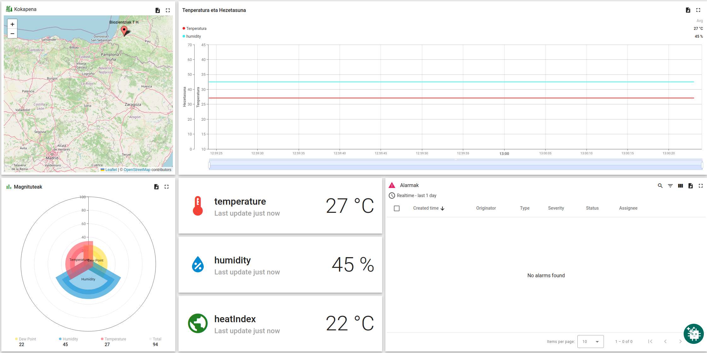
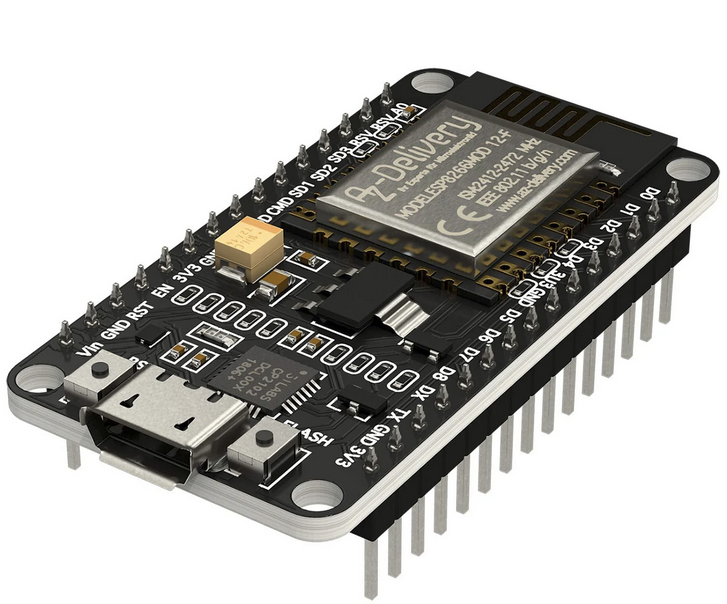
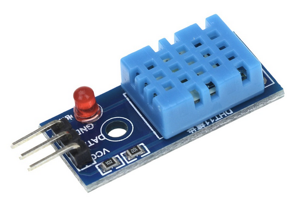

# Biozientzietan Digitalizazioa - NodeMCU DHT11 Proiektua

[Web orria: https://axpirina.github.io/Biozientzietan-Digitalizazioa/](https://axpirina.github.io/Biozientzietan-Digitalizazioa/)

ESP8266 NodeMCU eta DHT11 sensorea erabiliz ThingsBoard-era tenperatura, hezetasuna eta egonaldi bero indizea bidaltzeko plataforma.

---

## Dashboard - Denbora Errealeko Datuak

<p align="center">
  <br>
  <a href="https://eu.thingsboard.cloud/dashboard/b4a992a0-398d-11f1-ba44-c54ab1d7f1f4?publicId=ebbac470-3d80-11f1-92f7-cbbd42e0f134">Ikusi Dashboard-a</a>
</p>

---

## Zirkuituaren eskema elektronikoa

<p align="center">

</p>

### Fritzing Eskemak Deskargatzeko

| Osagaia | Irudia | Fitxategia |
|---------|--------|------------|
| NodeMCU V1.0 |  | [Deskargatu](Dokumentuak/Fritzing%20elementuak/NodeMCU%20V1.0.fzpz) |
| DHT11 Modulua |  | [Deskargatu](Dokumentuak/Fritzing%20elementuak/KY-015%20Temperature%20&%20Humidity%20Sensor%20Module.fzpz) |

Fritzing software librearen irudian oinarrituta: [fritzing.org](https://fritzing.org/)

---

## Softwarearen Konfigurazioa

### 1. Aldatu platformio.ini-n

```ini
monitor_speed = 115200
```

*Serie monitoreko datuen irakurketa sinkronizatzeko balio hau aldatu behar da.*

### 2. Konfiguratu WiFi eta MQTT

Kopiatu `include/secrets.h.example` fitxategia `include/secrets.h` izenarekin eta aldatu balioak:

```cpp
#define WIFI_SSID "ZURE_SSID"
#define WIFI_PASSWORD "ZURE_PASAHITZA"

#define MQTT_SERVER "eu.thingsboard.cloud"
#define MQTT_PORT 1883
#define MQTT_USERNAME "ZURE_TOKEN"
#define MQTT_TOPIC "v1/devices/me/telemetry"
```

### 3. ThingsBoard-en

1. Sortu device bat
2. Kopiatu "Access Token" (MQTT_USERNAME bezala erabili)

[ThingsBoard](https://eu.thingsboard.cloud/home)

---

## Egindako Zerbitzuak

- **WiFi**: Konfiguratzeko `include/secrets.h`-n
- **ThingsBoard**: eu.thingsboard.cloud
- **Tenperatura**: DHT11 sentsorea (0-50°C, ±2°C精确tasuna)
- **Hezetasuna**: DHT11 sentsorea (20-90% RH, ±5%精确tasuna)
- **Egonaldi Bero Indizea**: 17 hiritako latitude eta longitude koordenatuak

---

## Arazoak konpontzeko

### "Akatsa datuak irakurtzean!" nan balioak
1. Egiaztatu VCC 5V-ra konektatuta dagoela (3.3V ez da nahikoa izan daitekeelako)
2. Egiaztatu kableen konexioak
3. Probatu beste DHT sensor bat

### WiFi konexiorik ez
1. Egiaztatu SSID eta pasahitza zuzenak direla

### MQTT konexiorik ez
1. Egiaztatu token zuzena dela 
2. Egiaztatu eu.thingsboard.cloud erabiltzen ari zarela.

---

## Dokumentazio Gehiago

- [Irudiak](Dokumentuak/Irudiak/) - Zirkuituaren irudiak
- [Datu Orriak](Dokumentuak/datu%20orriak/) - Datuentzako fitxak
- [Eskuliburuak](Dokumentuak/Eskuliburuak/) - Dokumentazio liburuak
- [Fritzing Elementuak](Dokumentuak/Fritzing%20elementuak/) - Fritzing zirkuitu fitxategiak

---

## Lizentzia

MIT License - ikusi [LICENSE](LICENSE) fitxategia.

## Egilea

Plataforma: PlatformIO
Framework: Arduino
Plataforma IoT: ThingsBoard