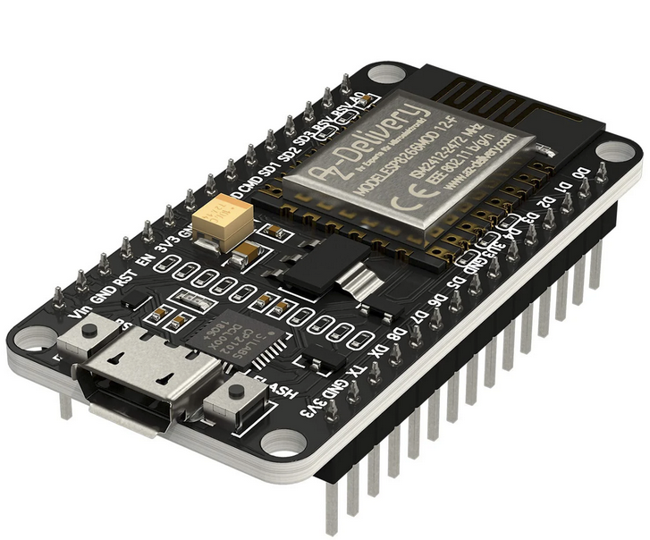
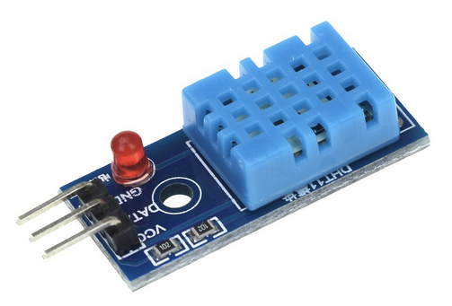
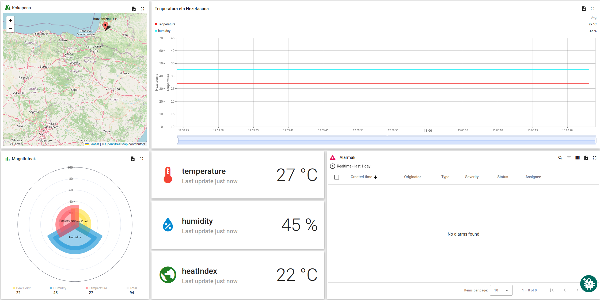

# Biozientzietan Digitalizazioa - NodeMCU DHT11 Proiektua

[https://axpirina.github.io/Biozientzietan-Digitalizazioa/](https://axpirina.github.io/Biozientzietan-Digitalizazioa/)

ESP8266 NodeMCU eta DHT11 sensorea erabiliz ThingsBoard-era tenperatura, hezetasuna eta intza puntua bidaltzen dituen proiektua.

---

## 1. Magnituteak. Hauek dira gure gailuak neurtuko dituen magnituteak.

- **Tenperatura**: 0-50°C, ±2°C zehaztasuna
- **Hezetasuna**: 20-90% RH, ±5% zehaztasuna
- **Intza puntua**: 0-50°C, ±2°C zehaztasuna

- **Laginketa Maiztasuna**: Laginketa maiztasuna 2s takoa izango da.

---

## 2. Zirkuituaren eskema elektronikoa

<p align="center">

</p>

### Fritzing Elementuak Deskargatzeko

| Osagaia | Irudia | Fitxategia |
|---------|--------|------------|
| NodeMCU V1.0 |  | [Deskargatu](Dokumentuak/Fritzing%20elementuak/NodeMCU%20V1.0.fzpz) |
| DHT11 Modulua |  | [Deskargatu](Dokumentuak/Fritzing%20elementuak/KY-015%20Temperature%20&%20Humidity%20Sensor%20Module.fzpz) |

Fritzing software librearen irudian oinarrituta: [fritzing.org](https://fritzing.org/)

---

## 3. Lainoaren Konfigurazioa: WiFi eta MQTT. Thingsboardekin konexioa include/secrets.h fitxategian definitzen da.

[eu.thingsboard.cloud](https://eu.thingsboard.cloud/home) plataformaren konfigurazioa.

Kopiatu `include/secrets.h.example` fitxategia `include/secrets.h` izenarekin eta aldatu balioak:

```cpp
#define WIFI_SSID "ZURE_SSID"
#define WIFI_PASSWORD "ZURE_PASAHITZA"

#define MQTT_SERVER "eu.thingsboard.cloud"
#define MQTT_PORT 1883
#define MQTT_USERNAME "ZURE_ACCESS_TOKENA"
#define MQTT_TOPIC "v1/devices/me/telemetry"
```

## Softwarearen Konfigurazio gehigarria

### Aldatu platformio.ini-n

```ini
monitor_speed = 115200
```

*Serie monitoreko datuen irakurketa sinkronizatzeko balio hau aldatu behar da.*
### ThingsBoard-en

1. Sortu device bat
2. Kopiatu "Access Tokena" (MQTT_USERNAME bezala erabili)

---
## 4.Sare Arkitektura

<p align="center">

</p>


Draw.io web errremintan oinarritua: [[draw.io](https://app.diagrams.net/)]

---
## 5.Arduino programa

```cpp
/*
ESP8266 Weather Station + Location (ThingsBoard Integration)

- DHT11 sentsorea: tenperatura, hezetasuna, dew point
- HTTP bidez: latitude eta longitude lortzen dira (ip-api.com)
- ThingsBoard-era bidalketa:
   * DHT datuak -> 5 segundoro
   * Lat/Lon    -> 30 minuturo

By Axpi (adapted)
*/

#include <ESP8266WiFi.h>
#include <PubSubClient.h>
#include <DHT.h>
#include <ESP8266HTTPClient.h>
#include <ArduinoJson.h>

// WiFi eta MQTT konfigurazioa
const char* ssid = "yourWiFiSSID";       // Zure WiFi izena
const char* password = "yourWiFiPassword"; // Zure WiFi pasahitza
const char* mqtt_server = "eu.thingsboard.cloud";

// ThingsBoard tokena
const char* mqtt_user = "yourDeviceToken";  
const char* mqtt_password = "";

// MQTT bezeroa
WiFiClient espClient;
PubSubClient client(espClient);

// DHT konfigurazioa
#define DHTPIN 2   // DHT11 datu pin (GPIO2)
#define DHTTYPE DHT11
DHT dht(DHTPIN, DHTTYPE);

// MQTT topic
const char* topic = "v1/devices/me/telemetry";

// Denborak
unsigned long lastDhtSend = 0;
unsigned long lastLocSend = 0;
const unsigned long dhtInterval = 5000;       // 5 seg
const unsigned long locInterval = 1800000;    // 30 min

// Latitude eta longitude
float latitude = 0.0;
float longitude = 0.0;

void setup_wifi() {
  delay(10);
  Serial.println();
  Serial.print("WiFi-ra konektatzen: ");
  Serial.println(ssid);

  WiFi.begin(ssid, password);

  while (WiFi.status() != WL_CONNECTED) {
    delay(500);
    Serial.print(".");
  }

  Serial.println("\nKonektatuta WiFi-ra!");
  Serial.print("IP helbidea: ");
  Serial.println(WiFi.localIP());
}

void reconnect() {
  while (!client.connected()) {
    Serial.print("MQTT-ra konektatzen...");
    if (client.connect("NodeMCUClient", mqtt_user, mqtt_password)) {
      Serial.println("Konektatuta!");
    } else {
      Serial.print("Huts! errore kodea = ");
      Serial.print(client.state());
      Serial.println(". 5 segundotan berriro...");
      delay(5000);
    }
  }
}

// ip-api.com-etik kokapena lortu
void updateLocation() {
  if (WiFi.status() == WL_CONNECTED) {
    HTTPClient http;
    http.begin("http://ip-api.com/json/");
    int httpCode = http.GET();

    if (httpCode > 0) {
      String payload = http.getString();
      StaticJsonDocument<512> doc;
      DeserializationError error = deserializeJson(doc, payload);

      if (!error) {
        latitude = doc["lat"];
        longitude = doc["lon"];
        Serial.printf("Kokapena eguneratuta -> Lat: %f, Lon: %f\n", latitude, longitude);
      } else {
        Serial.println("JSON errorea!");
      }
    } else {
      Serial.printf("HTTP errorea: %d\n", httpCode);
    }
    http.end();
  }
}

void setup() {
  Serial.begin(115200);
  setup_wifi();
  client.setServer(mqtt_server, 1883);
  dht.begin();
  updateLocation(); // lehenengo aldian kokapena jaso
}

void loop() {
  if (!client.connected()) {
    reconnect();
  }
  client.loop();

  unsigned long now = millis();

  // DHT datuak 5 segundoro bidali
  if (now - lastDhtSend > dhtInterval) {
    lastDhtSend = now;

    float temperature = dht.readTemperature();
    float humidity = dht.readHumidity();

    if (isnan(temperature) || isnan(humidity)) {
      Serial.println("Ezin izan da DHT sentsorea irakurri!");
      return;
    }

    // Dew point kalkulatu
    float a = 17.27;
    float b = 237.7;
    float alpha = ((a * temperature) / (b + temperature)) + log(humidity / 100.0);
    float dewPoint = (b * alpha) / (a - alpha);

    // JSON mezua
    String payload = "{\"temperature\":";
    payload += String(temperature);
    payload += ",\"humidity\":";
    payload += String(humidity);
    payload += ",\"dewPoint\":";
    payload += String(dewPoint);
    payload += "}";

    if (client.publish(topic, payload.c_str())) {
      Serial.print("DHT datuak bidalita: ");
      Serial.println(payload);
    } else {
      Serial.println("DHT publish huts egin du!");
    }
  }

  // Latitude/Longitude 30 minuturo bidali
  if (now - lastLocSend > locInterval) {
    lastLocSend = now;
    updateLocation();

    String payload = "{\"latitude\":";
    payload += String(latitude, 6);
    payload += ",\"longitude\":";
    payload += String(longitude, 6);
    payload += "}";

    if (client.publish(topic, payload.c_str())) {
      Serial.print("Kokapena bidalita: ");
      Serial.println(payload);
    } else {
      Serial.println("Kokapena publish huts egin du!");
    }
  }
}
```
---


## 6. Dashboarda - Denbora Errealeko Datuak

<p align="center">
  <br>
  <a href="https://eu.thingsboard.cloud/dashboard/b4a992a0-398d-11f1-ba44-c54ab1d7f1f4?publicId=ebbac470-3d80-11f1-92f7-cbbd42e0f134">Ikusi Dashboard-a</a>
</p>

---

## Egindako Zerbitzuak

- **WiFi**: Konfiguratzeko `include/secrets.h`-n
- **ThingsBoard**: eu.thingsboard.cloud
- **Tenperatura**: DHT11 sentsorea (0-50°C, ±2°C精确tasuna)
- **Hezetasuna**: DHT11 sentsorea (20-90% RH, ±5%精确tasuna)
- **Egonaldi Bero Indizea**: 17 hiritako latitude eta longitude koordenatuak

---

## Arazoak konpontzeko

### "Akatsa datuak irakurtzean!" nan balioak
1. Egiaztatu VCC 5V-ra konektatuta dagoela (3.3V ez da nahikoa izan daitekeelako)
2. Egiaztatu kableen konexioak
3. Probatu beste DHT sensor bat

### WiFi konexiorik ez
1. Egiaztatu SSID eta pasahitza zuzenak direla

### MQTT konexiorik ez
1. Egiaztatu token zuzena dela 
2. Egiaztatu eu.thingsboard.cloud erabiltzen ari zarela.

---

## Dokumentazio Gehiago

- [Irudiak](Dokumentuak/Irudiak/) - Zirkuituaren irudiak
- [Datu Orriak](Dokumentuak/datu%20orriak/) - Datuentzako fitxak
- [Eskuliburuak](Dokumentuak/Eskuliburuak/) - Dokumentazio liburuak
- [Fritzing Elementuak](Dokumentuak/Fritzing%20elementuak/) - Fritzing zirkuitu fitxategiak

---

## Lizentzia

MIT License - ikusi [LICENSE](LICENSE) fitxategia.

## Egilea

Plataforma: PlatformIO
Framework: Arduino
Plataforma IoT: ThingsBoard
